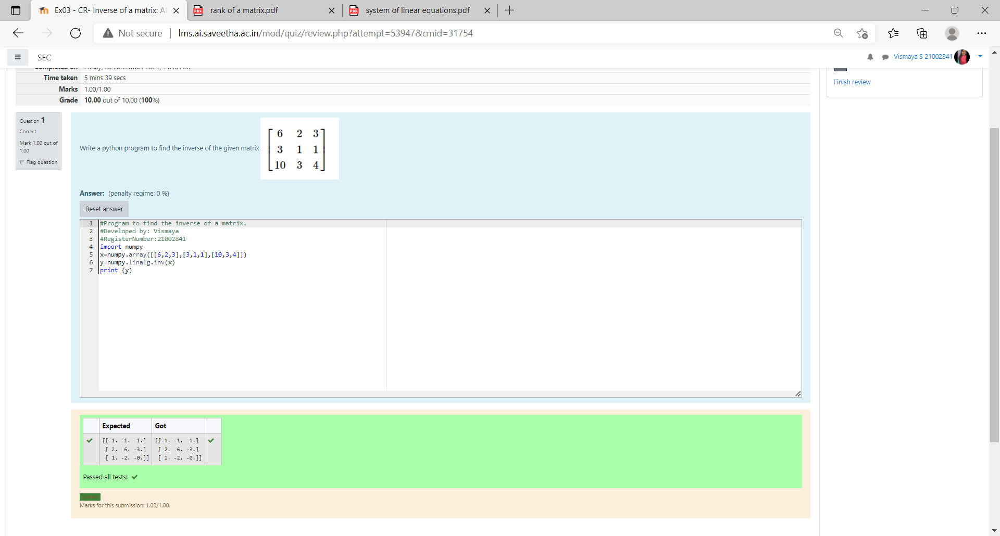

# INVERSE-OF-A-MATRIX
## Aim:
To write a python program to find the inverse of a matrix
## Equipment’s required:
1. 	Hardware – PCs
2. 	Anaconda – Python 3.7 Installation / Moodle-Code Runner
## Algorithm:
### Step1 : 
import the numpy module to use the built-in functions for calculation

### Step 2:
prepare the lists from each inverse of matrix and assign in np.array()

### Step 3:
using the np.linalg.solve().we can find the solution.

### Step 4:
End the program 

## Program:
~~~
#program dveloped by VISMAYA.S
#reference number 21002841
import numpy
x=numpy.array([[6,2,3],[3,1,1],[10,3,4]])
y=numpy.linalg.inv(x)
print (y)
~~~
## Output:

## Result:
Thus the inverse of given matrix is successfully solved using python program

